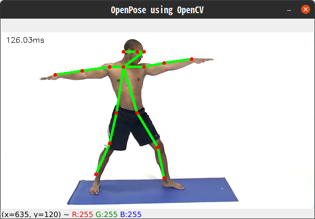
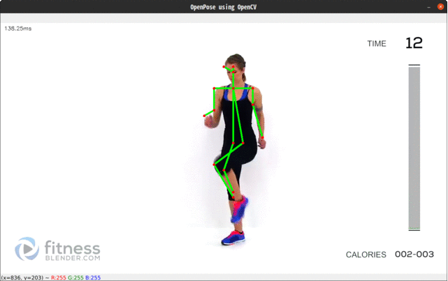

# human-pose-estimation-opencv
Perform Human Pose Estimation in OpenCV




# Setup

- Create python env

```
pyhton -m venv env
```

-Activate python env

```
source env/bin/activate 
``` 
- Install requirements with pip

```
pip install -r requirement.txt
```

# Test with following commands

- Test with video

```
python ai_trainer.py
```